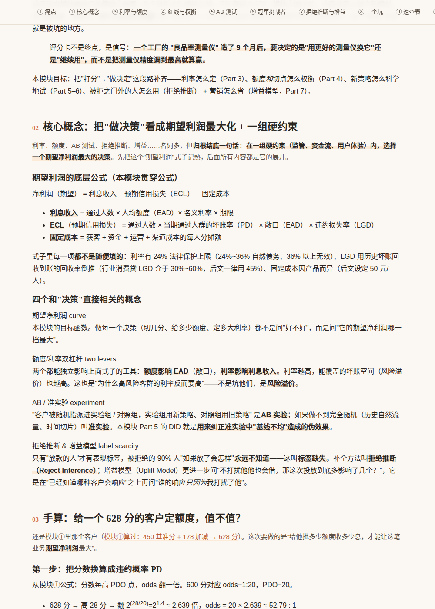
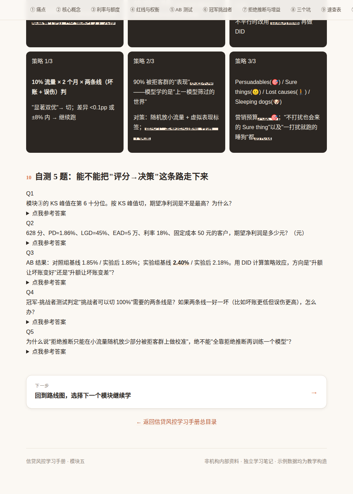

# Atlas 项目分析报告

> 评审日期：2026-09-24 ｜ 评审对象：`atlas` 仓库 @ `7ac7fdf`
> 评审范围：总目录、`design-system/`、`DESIGN-SPEC.md`（801 行）、课题 `credit-risk` 的目录页与模块①–⑤正文（共 3,240 行 HTML）
> 评审方法：通读设计说明书；用脚本统计各模块的组件使用、交叉引用、未定义样式类；用无头浏览器截图检查渲染；按模块③原始数据复算模块⑤的关键表格

---

## 0. 结论先行

**整体判断：教学设计的内核是对的，而且比大多数"个人笔记"强很多；真正的短板在"工程纪律"和"泛化抽象"两层。** 前 4 个模块质量整齐，模块⑤是第一个"脱离设计系统、也脱离叙事线"的模块，暴露出这套架构目前只靠人工自觉维持一致性。

| 维度 | 评分 | 一句话 |
|---|---|---|
| 学习效果设计 | ★★★★☆ | 痛点先行、可复算例子、跨模块连续剧是真正的亮点；缺"主动产出"和"间隔复习"环节 |
| 内容准确性 | ★★★☆☆ | ①–④扎实；⑤的核心表格与模块③自相矛盾，且无法复算 |
| 架构与可维护性 | ★★★☆☆ | 零构建的取舍合理；但无任何自动校验，状态要在 4 处手动同步，模板与说明书已经漂移 |
| 跨课题泛化 | ★★☆☆☆ | 说明书写了泛化章节，但本身是"信贷风控专用说明书"，硬编码参数多，缺课题级模板 |

**最该先做的 5 件事**（详见 §6）：

1. **修模块⑤的数字**：它声称沿用模块③的 10,000 人样本，但 KS 峰值位置、各档坏账率都对不上（§3.3）。
2. **修模块⑤的样式**：用了 25 个 `style.css` 里不存在的类（共 106 处），概念卡、自测、公式都是裸文本；暗色速查卡里的荧光笔让 11 处重点文字不可读（§4.1）。
3. **加一个校验脚本** `tools/check.py`：未定义类、坑/题数量、图号冲突、状态四处同步、叙事线数字一致性——零构建原则下也能做（§4.2）。
4. **拆分说明书**：`DESIGN-SPEC.md` 拆成"全站设计系统 + 教学方法论 + 课题规格"三层（§5.1）。
5. **把"读"升级为"练"**：`data/` 放叙事线数据，让自己真能复算；自测改成"先写后看"并链回对应 Part（§3.2）。

---

## 1. 现状速写

```
atlas/
├── index.html                  总目录（课题卡片）
├── DESIGN-SPEC.md              设计规格说明书（实为信贷风控手册专用，801 行）
├── design-system/
│   ├── style.css               共享样式（363 行，约 100 个类）
│   └── module-skeleton.html    新模块模板（44 行）
└── topics/credit-risk/
    ├── index.html              课题 hub（100 行）
    ├── manual/01–05-*.html     5 个模块（508 / 540 / 649 / 814 / 729 行）
    ├── figures/                10 张 matplotlib 真实数据图（仅模块④使用）
    ├── data/  reports/         空（只有 .gitkeep）
```

各模块对"固定教学骨架"的执行情况（脚本统计）：

| 模块 | Part | 坑 | 自测 | 速查卡 | 概念卡 | 类比 | 手算框 | 教学图 | 真实图 | 外链到其他模块 |
|---|---|---|---|---|---|---|---|---|---|---|
| ① 评分卡 | 11 | 3 | 5 | 8 | 3 | 1 | 4 | 2 | 0 | ②③ |
| ② 特征工程 | 11 | 3 | 5 | 8 | 6 | 2 | 2 | 3 | 0 | ③ |
| ③ 评估指标 | 10 | 3 | 5 | 8 | 6 | 4 | 2 | 6 | 0 | — |
| ④ 资产质量 | 10 | 3 | 5 | 9 | 11 | 3 | 4 | 4 | 10 | — |
| ⑤ 决策策略 | 10 | 0* | 0* | 9 | 0* | 0 | 0* | 4 | 0 | ① |

\* 模块⑤并非没有这些内容，而是改用了自造的 `trap` / `quiz` / `def-list` / `calc-step` 等类，这些类在 `style.css` 里没有定义（见 §4.1）。

---

## 2. 设计哲学评估：方向是否合理

**合理，且有几处是真正懂学习的设计。**

- **痛点先行**：每个模块第一 Part 固定为"朴素做法为什么会骗人"。这对应学习科学里的"认知冲突"——先让旧直觉失效，新概念才有落脚点。模块③"准确率 99% 却不能上线"、模块④"整体不良率会骗人"都是教科书级的开场。
- **凡例子必可复算**：要求每个数字都能手算验证，这比"讲清楚"更高一层——它逼着作者自己真懂，也让读者可以检验。
- **跨模块连续剧（§7.3）**：同一个特征"近 3 个月申请次数"从②算 WOE/IV（0.563）→ ①进评分卡（628 分）→ ③上线 9 个月后 PSI 漂移（0.179）→ ⑤拿 628 分客户定额度。**这是整个项目最有价值的设计**：知识不是孤立卡片，而是一条因果链，符合"精细加工 + 情境化"的深度学习路径。
- **教学层 / 真实层分离**：假数据用 Chart.js 并强制脚注，真实数据用 matplotlib 并打 `tag-real`，且把"复核时抓到的错误"写成内容——这是很成熟的诚实性设计。
- **非目标写得清楚**：不做仪表盘、不写 JS 逻辑、不用构建工具。对一个个人长期项目，这是正确的"降低维护成本"取舍。

**需要校准的一点**：说明书把很多"这一个课题碰巧如此"的参数写成了硬规则（恰好 3 个坑、恰好 5 题、恰好 7 个模块、必须 2 条正交主线）。对信贷风控合适，对别的课题会变成束缚（§5.2）。

---

## 3. 学习效果：帮助深度理解方面

### 3.1 做得好的

| 机制 | 落地情况 | 作用 |
|---|---|---|
| 学习目标清单（checklist） | 5/5 模块都有，动词开头、可检验 | 让"读完"有判定标准 |
| 类比 → 精确表述 | ①–④共 10 处类比，均紧跟精确定义 | 先建直觉再建模型 |
| 手算 + 计算框 | ①–④共 12 个 calc-box | 从"知道"推到"会算" |
| 三个坑 | ①–④各 3 个 | 负例学习，防止机械套用 |
| 口诀 / 记忆点 | 每模块 summary + mnemonic-line | 为长期记忆留锚点 |
| 叙事线 | ①②③⑤ 互相引用具体数字 | 把知识织成网 |

### 3.2 主要不足与建议

**(1) 输入多、产出少——缺"主动回忆"。**
自测只在文末 5 题，答案一点就开，很容易"看一眼答案就觉得会了"（流畅性错觉）。

- 建议：每个 Part 末尾加一道 1 行的"停一下"预测题（先猜再往下读），不需要 JS。
- 自测题在 `<summary>` 前加一句"先把答案写在纸上 / 笔记里再展开"；每题答案末尾加"↩ 回看 Part N"锚点链接（目前正文里指向本页 Part 的链接全站只有 1 处）。
- 建一张 checklist ↔ 自测题 ↔ Part 的对齐表，保证每条学习目标都至少被一道题检验。

**(2) "可复算"停留在作者层，读者没有素材真去算。**
`data/` 目录是空的，所有计算只以文字形式存在于 HTML 中。

- 建议：`data/narrative.csv`（或 `.xlsx`）存放叙事线的原始数据（③的十分位表、②的分箱表等），外加一个 Excel 或 Python 小练习，让你亲手重算 KS、IV、净利润。
- 这份数据同时是**叙事线的唯一事实来源**——这正好能防住 §3.3 那类错误。

**(3) 缺间隔复习与跨模块交错练习。**
每个模块自成一套题，没有把①–⑤混在一起考的地方。

- 建议：在课题目录加一个 `review.html`：汇总所有口诀、速查卡和"跨模块综合题"（例：给一个客户，从分箱 → 评分 → 定额度 → 上线监控走一遍）。也可以把速查卡导出成 Anki 卡片 CSV。

**(4) 缺反思与迁移。**
内容都是"讲给别人听"的，没有"这和我的工作有什么关系"的位置。

- 建议：`reports/` 的用途可以定为**学习日志 / 工作映射**：每学完一个模块写 3 行——卡住的点、和资产证券化工作的对应（例如 Vintage/静态池 ↔ 入池资产表现、迁徙率 ↔ 现金流压力测试假设、PD/LGD ↔ 分层与信用增级）、还没搞懂的问题。
- 结合你的工作背景，**模块⑦里的"ABS 资产证券化"其实不该是选修外延，而是整本手册的落地出口**。建议把它升级为一个桥接模块，或者单独开一个 ABS 课题，与本课题双向链接。

**(5) 深度锚点只有一篇公众号文章。**
起点来源只有一篇科普文，全手册没有权威教材、监管文件的延伸阅读。

- 建议：每个模块页脚加"延伸阅读"（1 本教材章节 + 1 份监管 / 行业文件 + 1 个实务来源），用来校准深度，也方便日后查证。

**(6) 两套编号增加认知负担。**
模块编号（①–⑦按业务分组）和推荐学习顺序（③→②→①→④→⑤…）不一致，目录页要用"推荐第③步"这样的标签来解释。

- 建议：要么按学习顺序重新编号，要么在模块页 masthead 显示"学习顺序第 N 站"。二选一，不要两套并存。

### 3.3 内容准确性：模块⑤的叙事线断裂（高优先级）

模块⑤ Part 4 写的是"沿用模块③ K1/K2 的同一批 10,000 申请人"，但数字与模块③对不上：

| 项 | 模块③原文 | 模块⑤引用 |
|---|---|---|
| KS 峰值位置 | 第 4 十分位 | 第 6 档 |
| KS 值 | 0.46（累计坏 84.0%，累计好 37.7%） | ≈0.54（累计好 82%，累计坏 28%） |
| 自测 Q1 | — | "模块③的 KS 峰值在第 6 十分位"（错误前提） |

模块⑤那张 10 档表格自身也无法复算：

- 利息列隐含每人 EAD≈12 万元，ECL 列隐含 EAD≈2 万元，而 Part 3 设定 EAD=5 万元；
- 第 9 档"通过人群坏账率"9.0%，第 10 档全放却只有 5%——累计坏账率不可能先升到 9% 再降回 5%。
- 图 D2 标题说"峰值落在第 6 档"，但图表数据是 `[8541, 10649, 12746, 14808]`，第 7 档更高，且第 7 档 PD 4.4% 并未突破文中所说的 4.5% 红线。

用模块③的原始十分位数据（从低风险往高风险放款，EAD 5 万、利率 18%、LGD 45%、固定成本 50 元 / 人）复算，结果如下：

| 放到第几档 | 通过人数 | 累计坏客户 | 通过人群坏账率 | 期望净利润（万元） |
|---|---|---|---|---|
| 4 | 4,000 | 20 | 0.50% | 3,535 |
| 6 | 6,000 | 80 | 1.33% | 5,190 |
| 8 | 8,000 | 230 | 2.88% | 6,642 |
| 10 | 10,000 | 500 | 5.00% | 7,825 |

**好消息**：模块⑤想教的核心结论——"只看财务公式，净利润随切点单调上升，全放最赚钱；所以必须由业务红线来划定可选区间"——在正确数字下依然成立。问题出在数字，不在观点，修复成本不高。

**对学习的影响**：这类错误对深度学习的伤害比错别字大得多——读者（未来的你）若按"凡例子必可复算"去验证，会在模块之间来回对不上，反而怀疑自己没懂。这也说明**叙事线目前只靠人工核对，没有机制保障**。

---

## 4. 架构与可维护性

### 4.1 设计系统已经发生漂移

**模块⑤使用了 25 个未定义的样式类，共 106 处**：`compare-card`、`def-term`、`formula`、`calc-step`、`trap`、`quiz` / `quiz-q` / `quiz-a`、`cheat-tag`、`figure-note`、`row-hl` 等。页面里也没有 `<style>` 块，所以这些内容全部以裸文本渲染：

- 核心概念、公式、手算步骤没有卡片和层次（见截图 1）；
- 自测题没有折叠卡片样式（见截图 2）；
- 暗色速查卡里的 `<strong>` 继承了全站"赭橙荧光笔"效果，浅色底块压在白字上，**11 处重点文字不可读**（见截图 2 上半部分）；
- 没有 `summary-box` 和口诀，4 张图没有"示例数据"脚注（全站规范要求每张教学图都带）。





**根因**：

1. `module-skeleton.html` 与说明书脱节：没有 masthead、checklist、summary-box、Chart.js；导航用 `div` 而不是 `nav`；Part 序号用 ① 而不是说明书规定的 `01`。照着它写新模块，必然偏离规范。
2. 说明书附录 D 的"可直接填空骨架"仍引用旧的扁平路径 `href="style.css"`，按新目录结构会断链。
3. 没有任何自动检查，偏离只能靠肉眼发现。

**修复二选一**：
- A（推荐）：把⑤改写为现有组件（`concept-card`、`calc-box`、`pitfall`、`quiz-item`、`chart-card`）。
- B：如果 `compare-card`（两方案对比卡）确实是新需求，把它正式补进 `style.css` 和说明书 §5，再让⑤使用。
- 无论选哪个，都要修 `.cheat-card strong` 在暗底上的样式。

### 4.2 一致性全靠手工

| 需要手动同步的地方 | 已出过的问题 |
|---|---|
| 模块状态：课题目录卡片 / 顺序条 / 课题页脚 / 总目录进度（4 处） | 上次发现"4/7"与"已完成"不一致 |
| 叙事线数字：②①③⑤ 多处 | §3.3 的 KS 峰值矛盾 |
| 图号前缀：全局字母表 | ⑤用"图 D1–D4"，与④的"图D"冲突；④还有 6 张图未编号 |
| 固定数量：3 坑 / 5 题 / 8–9 速查卡 | ⑤因类名不同，按规范检查全部"缺失" |
| Chart.js 全局配置 | 每页复制一遍，改一次要改 5 处 |

**建议：加一个不破坏"零构建"原则的校验脚本** `tools/check.py`（只用 Python 标准库，不生成任何文件，只报告问题）：

1. 所有 HTML 用到的 class 都必须在 `style.css` 中有定义；
2. 每个模块：坑=3、自测=5、速查卡 8–9、每个 `<canvas>` 有对应脚注；
3. 图号在课题内唯一，所有 `` / 相对链接 / `#锚点` 能解析；
4. 模块状态四处一致（读一份 `topic.json` 清单作为唯一来源）；
5. 叙事线关键数字（`data/narrative.csv` 中的 KS、IV、PSI、628 分等）在所有 HTML 中出现时一致。

每次新增模块或提交前跑一遍即可。以 AI 协作写作的方式推进时，这一步尤其重要——⑤就是生成后没有经过这类校验。

### 4.3 说明书本身的维护负担

`DESIGN-SPEC.md` 801 行、56KB，混合了四类内容：全站视觉系统、教学方法论、信贷风控专属内容（叙事线数字、Excel 路径、图号占用）、历史变更记录。已有过时条目：

- §8 仍写"git 仓库根在 LikeCodeNex""`.claude/launch.json` 的 credit-risk-handbook 配置"；
- §3.1 模板仍为 `href="style.css"`；
- §6.4 记录了本机 Excel 绝对路径；
- §9 标题"以模块⑤为例"，而⑤已完成。

说明书头部写着"发现代码与文档不一致时，以代码为准，并回来更新文档"——但越长越不会被回头更新。拆分方案见 §5.1。

### 4.4 其他工程点

- **Chart.js 走 CDN**：离线打开时所有教学图表消失。建议把 `chart.umd.min.js` 放进 `design-system/vendor/`，并抽出 `design-system/chart-defaults.js` 共享全局配置（仍然零构建）。
- **`data/` 与 `reports/` 目录用途未定义**：建议在说明书里写明（见 §3.2 (2)(4)）。
- **真实数据的隐私边界**：模块④的真实图来自本机"发行台账 / 静态池"文件，仓库已配置 gitee 远端。请确认 gitee 仓库是私有的，或确认所用静态池数据属于公开披露口径。

---

## 5. 跨课题泛化

### 5.1 结构问题：全站规范与课题规范没有分层

总目录叫 Atlas、定位为"研究课题集散地"，但唯一的说明书标题是"信贷风控学习手册 · 设计规格说明书"，且放在仓库根目录。新开一个课题时，没法判断哪些该遵守、哪些该替换。

**建议拆成三层：**

| 文件 | 层级 | 内容 | 新课题是否改动 |
|---|---|---|---|
| `design-system/DESIGN-SYSTEM.md` | 全站 | tokens、组件库、图表规范、技术约束 | 不改 |
| `design-system/PEDAGOGY.md` | 全站 | 教学骨架、写作规范、自测写法、课题原型（见 §5.2） | 不改，按原型选用 |
| `topics/<slug>/TOPIC.md` | 课题 | 主线、模块表、叙事线数字、图号、数据来源、类比池、状态 | 每个课题一份 |

外加 `topics/<slug>/topic.json`：模块清单与状态，供校验脚本读取，是状态的唯一来源。

### 5.2 参数过拟合：需要"课题原型"

现在的骨架（痛点 → 概念 → **手算** → 案例 → 3 坑 → 速查 → 5 题）天然适合"计算 / 模型型"课题。换成法规、流程或宏观框架类课题，"手算一遍"和"阈值表"就会被硬凑。

**建议定义 4 种课题原型，共享外壳、替换核心 Part：**

| 原型 | 例子 | 核心 Part 替换为 | 自测侧重 | 图表侧重 |
|---|---|---|---|---|
| 计算 / 模型型 | 信贷风控、量化、ABS 现金流 | 手算一遍 | 计算题 | 曲线、分布 |
| 制度 / 法规型 | 证券化监管、个保法 | 条文拆解 + 情景判例 | 情景判断题 | 流程图、对照表 |
| 流程 / 实务型 | 发行全流程、尽调 | 流程演练 + 文档样例 | 排序、找错题 | 时间轴、泳道图 |
| 概念 / 框架型 | 宏观、行业研究 | 框架对比 + 案例套用 | 辨析、迁移题 | 矩阵、因果图 |

数量类规则改成区间 + 默认值：坑 2–4（默认 3）、自测 4–7（默认 5，至少 1 道迁移题）、模块 4–10。"必须 2 条正交主线，找不到就别写"改为"至少 1 条主线；第二维可以是标签"。

### 5.3 缺少课题级模板与跨课题机制

- **没有课题目录页模板**：总目录的说明写着"复制 `module-skeleton.html` 为新课题首个模块页"，但新课题首先需要的是一个目录页（hub），这个模板不存在。建议新增 `design-system/topic-index-skeleton.html`，内含 MAP 段、模块卡、顺序条、起点说明、页脚。
- **图号全局字母前缀不可扩展**：26 个字母很快用完，跨课题必然冲突。建议改为课题内"模块号.序号"（如"图 5.2"），课题之间天然隔离。
- **没有跨课题链接约定**：例如 ABS 课题引用本课题模块④的 Vintage。建议约定相对路径写法，并在总目录下维护一个共享术语表 `glossary.html`，为每个术语登记"主讲在哪个课题 / 模块"。
- **课题视觉识别**：所有课题同色。可以在 `<body data-topic="credit-risk">` 上覆写 `--brand` 三个 token，给每个课题一个强调色，其余设计不变。

---

## 6. 改进路线图

| 优先级 | 事项 | 涉及文件 | 工作量 |
|---|---|---|---|
| **P0** | 模块⑤数字对齐模块③：重算 Part 4 表格、图 D2 结论、自测 Q1 | `05-strategy.html` | 中 |
| **P0** | 模块⑤改用现有组件（或正式补充新组件）；修暗卡荧光笔；补 summary-box 与图表脚注 | `05-strategy.html`、`style.css` | 中 |
| **P0** | 图号冲突：⑤改为非 D 前缀（或全面改为"图 5.x"）；④的 6 张未编号图补号 | `04`、`05` | 小 |
| **P0** | `tools/check.py` 校验脚本（§4.2 五项） | 新增 | 中 |
| P1 | 说明书拆三层，清理过时条目；`topic.json` 作为状态唯一来源 | `DESIGN-SPEC.md` → 3 个文件 | 中 |
| P1 | 更新 `module-skeleton.html` 与说明书附录 D 一致；新增课题目录页模板 | `design-system/` | 小 |
| P1 | `data/narrative.csv` + 复算练习（Excel 或 notebook） | `topics/credit-risk/data/` | 中 |
| P1 | 自测"先写后看" + 答案链回 Part；每个 Part 末尾加预测题 | 各模块 | 中 |
| P1 | Chart.js 本地化 + 共享 `chart-defaults.js` | `design-system/` | 小 |
| P2 | 课题原型（§5.2）写入 PEDAGOGY | 新文档 | 中 |
| P2 | `review.html` 跨模块综合复习页 / Anki 导出 | 课题目录 | 中 |
| P2 | ABS 桥接：把模块⑦的 ABS 部分升级为独立课题或桥接模块 | 新课题 | 大 |
| P2 | 学习日志 / 工作映射写进 `reports/`；每模块补延伸阅读 | 各模块 | 持续 |

**建议节奏**：先完成 P0（1–2 次会话），再写模块⑥。否则⑥会沿着⑤的偏差继续扩大，之后返工成本更高。

---

## 附录：评审数据

**A. 模块⑤未定义类清单（25 个，共 106 处）**
`compare-cards` `compare-card` `compare-hd` `compare-ft` `quote` `formula` `formula-main` `def-list` `def` `def-term` `calc-steps` `calc-step` `calc-step-num` `calc-step-body` `figure-note` `row-hl` `trap` `trap-num` `trap-body` `cheat-tag` `quiz-list` `quiz` `quiz-q` `quiz-no` `quiz-a`

**B. 模块间引用关系**

| 从 \ 到 | ① | ② | ③ | ④ | ⑤ |
|---|---|---|---|---|---|
| ① | — | ✓ | ✓ | | |
| ② | | — | ✓ | | |
| ③ | | | — | | |
| ④ | | | | — | |
| ⑤ | ✓ | | | | — |

所有跨模块链接都只到页面级，没有定位到具体小节的锚点。③④没有任何对外链接；模块④在叙事线上与其他模块完全独立。

**C. 复算口径**
模块③十分位表（坏客户数，从高风险到低风险：150/120/90/60/40/20/10/5/3/2），从低风险端开始逐档放款；EAD 5 万元、年利率 18%、LGD 45%、固定成本 50 元 / 人；净利润 = 利息 − 累计坏客户 × EAD × LGD − 人数 × 固定成本。
